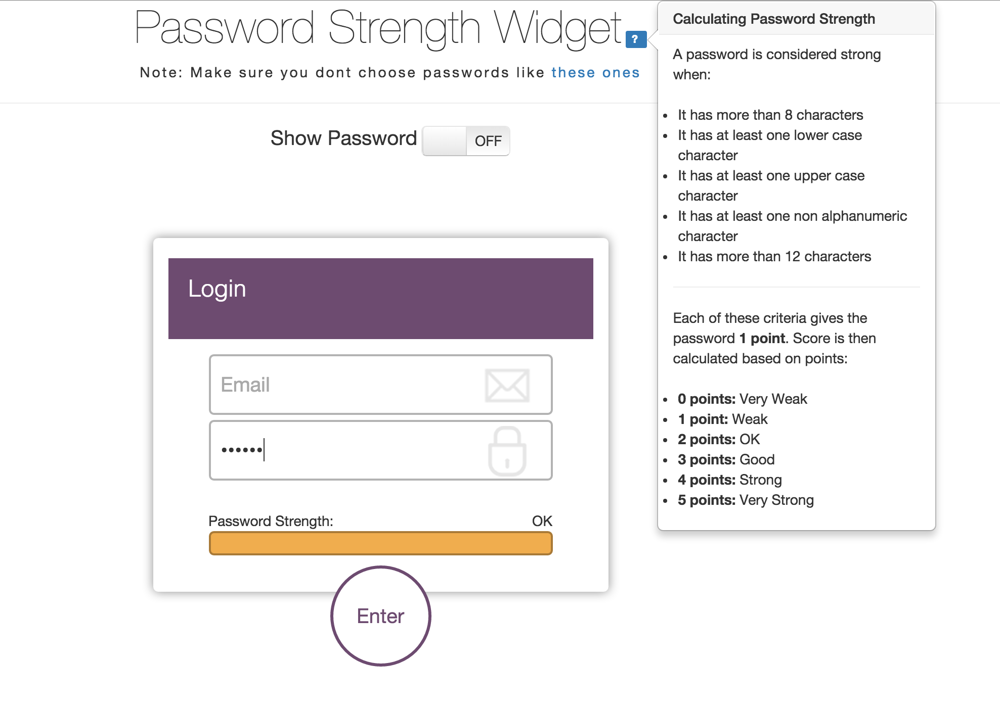

#Password Strength Widget
**By: Tabish Khan**

-

Javascript Widget that displays password strength based on certain criteria:

Also alerts you if selected password is too weak - that is, a password on <a href="http://www.cnn.com/2012/10/25/tech/web/worst-passwords-2012/">this</a> list.

-

*Developed using jQuery+Javscript, HTML+CSS. Integrated with Bootstrap popover.js and switch.js components*
